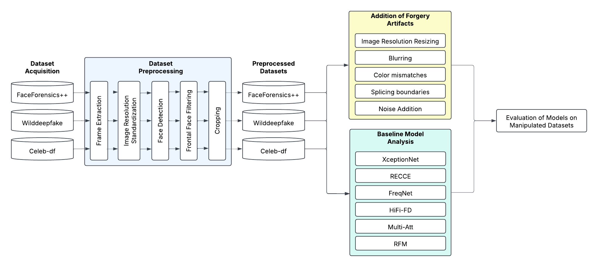

# Spotting the Unseen: A Comprehensive Analysis of Face Forgery Detection Models

This repository contains the resources, implementation details, and evaluation results for our study on comparing state-of-the-art face forgery detection models under varying perturbation scenarios. This project was conducted as part of our undergraduate thesis and presented at a research conference.

## System Architecture

Below is the end-to-end pipeline we developed and followed throughout the study:

## Methodology

### 1. Dataset Acquisition

- **FaceForensics++ (c23 & c40)**
- **WildDeepfake**
- **Celeb-DF**

Each dataset includes both real and manipulated face videos. We extract and preprocess frames from these videos for consistency across evaluation conditions.

### 2. Preprocessing Steps

- Frame extraction at uniform intervals
- Resolution standardization (256×256)
- Face detection and alignment using head pose filtering
- Cropping and normalization

### 3. Forgery Artifact Simulation

To mimic real-world deepfake conditions, we apply the following perturbations:

- **Image Resolution Resizing** (512x512, 128×128, 64×64)
- **Blurring** (Gaussian blur with increasing intensity)
- **Color Mismatches** (localized hue/brightness alterations)
- **Splicing Boundaries** (Canny edge enhancements)
- **Noise Addition** (Salt & Pepper, 10–50%)

### 4. Models Evaluated

| Model      | Type            | Highlights |
|------------|------------------|------------|
| [Xception](https://openaccess.thecvf.com/content_cvpr_2017/papers/Chollet_Xception_Deep_Learning_CVPR_2017_paper.pdf)   | Spatial-based     | CNN with depthwise separable convolutions |
| [Multi-Att](https://openaccess.thecvf.com/content/CVPR2021/papers/Zhao_Multi-Attentional_Deepfake_Detection_CVPR_2021_paper.pdf)  | Attention-based   | Multi-head attention on facial subregions |
| [FreqNet](https://ojs.aaai.org/index.php/AAAI/article/download/28310/28609)   | Frequency-based   | FFT-domain convolutional analysis |
| [RECCE](https://openaccess.thecvf.com/content/CVPR2022/papers/Cao_End-to-End_Reconstruction-Classification_Learning_for_Face_Forgery_Detection_CVPR_2022_paper.pdf)     | Spatial-based     | Reconstruction-guided attention |
| [HiFi-FD](https://openaccess.thecvf.com/content/CVPR2021/papers/Luo_Generalizing_Face_Forgery_Detection_With_High-Frequency_Features_CVPR_2021_paper.pdf)    | Frequency-based   | High-frequency noise-aware modeling |
| [RFM](https://openaccess.thecvf.com/content/CVPR2021/papers/Wang_Representative_Forgery_Mining_for_Fake_Face_Detection_CVPR_2021_paper.pdf)     | Attention-based            | Custom experimental architecture |

## Performance Metrics

Models were evaluated using:

- **Accuracy** – Correct predictions over all samples
- **Precision** – True positives over predicted positives
- **Recall** – True positives over actual positives
- **F1 Score** – Harmonic mean of precision and recall

## Key Findings

| Model     | Unaltered Accuracy | F1-Score under Noise 50% |
|-----------|--------------------|--------------------------|
| Xception  | 99.83%             | 66.67%                   |
| Multi-Att | 99.96%             | 68.42%                   |
| FreqNet   | 87.79%             | 66.44%                   |

- **Xception** performs consistently well across resolution and color changes.
- **Multi-Att** demonstrates resilience in identifying localized manipulation, especially splicing.
- **FreqNet** is more vulnerable to compression and noise but excels in blur-based perturbations.

## Environment

- Python 3.8+
- PyTorch 1.10+
- CUDA 11+ (if using GPU)
- OpenCV, NumPy, scikit-learn
