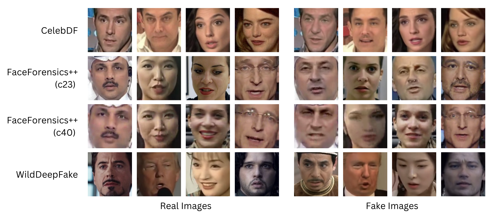

# Datasets

This folder contains information on the datasets used for training and evaluating our selected face forgery detection models.

## Included Datasets

### 1. Celeb-DF v2
- **Description:** High-quality deepfake dataset featuring 59 celebrities with minimal visual artifacts.
- **Download Instructions:** [Celeb-DF GitHub](https://github.com/yuezunli/celeb-deepfakeforensics)

### 2. FaceForensics++ (FF++)
- **Variants:** c23 (light compression), c40 (heavy compression)
- **Description:** Includes four manipulation methods (DeepFakes, Face2Face, FaceSwap, NeuralTextures) applied to YouTube videos.
- **Download Instructions:** [FaceForensics++ GitHub](https://github.com/ondyari/FaceForensics)

### 3. WildDeepfake
- **Description:** Real-world deepfakes sourced from the internet, challenging due to their varied quality and lack of synthetic artifacts.
- **Download Link:** [WildDeepfake on Hugging Face](https://huggingface.co/datasets/xingjunm/WildDeepfake/tree/main)
